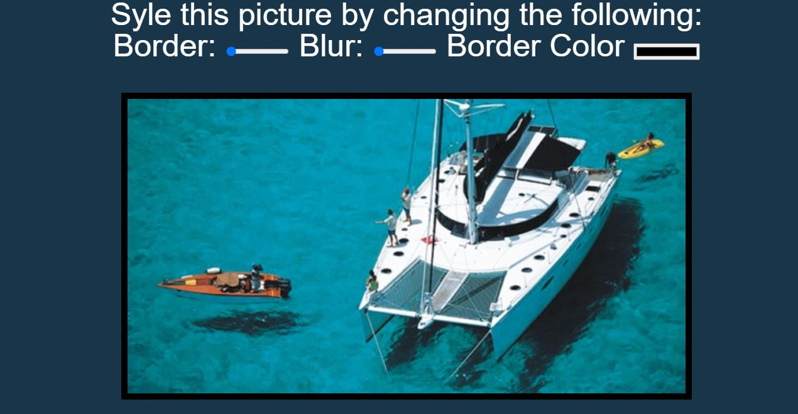

# CSS Variables

This is project 3 in Wes Bos' JavaScript 30 course. This week we built a web-page that styles a photo by adding a border, blur filter, and / or allowing the user to change the border color.  It was built using HTML, JS and CSS variables. 

